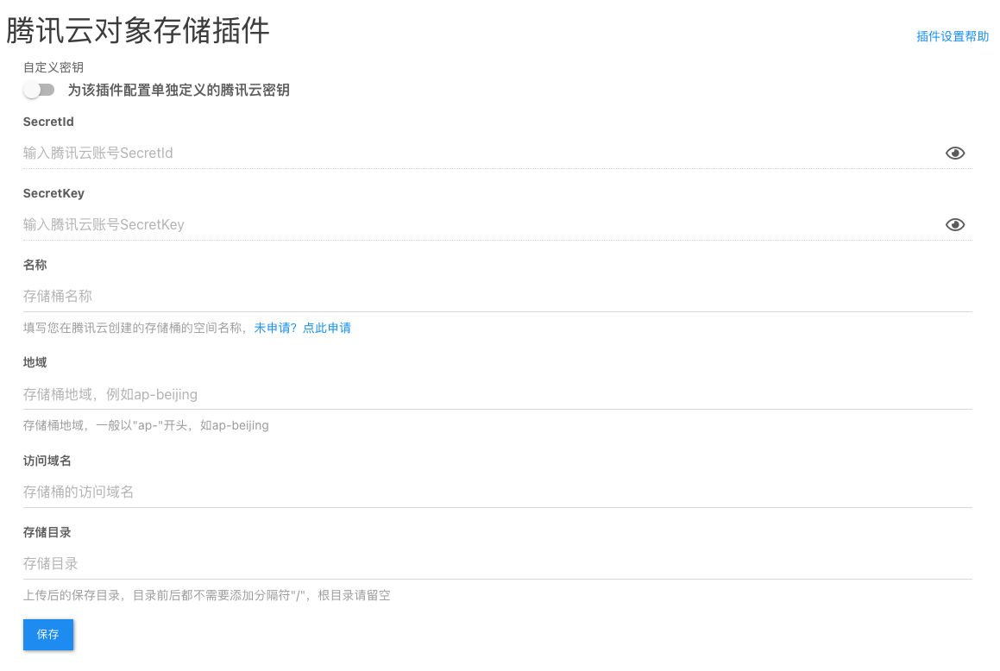
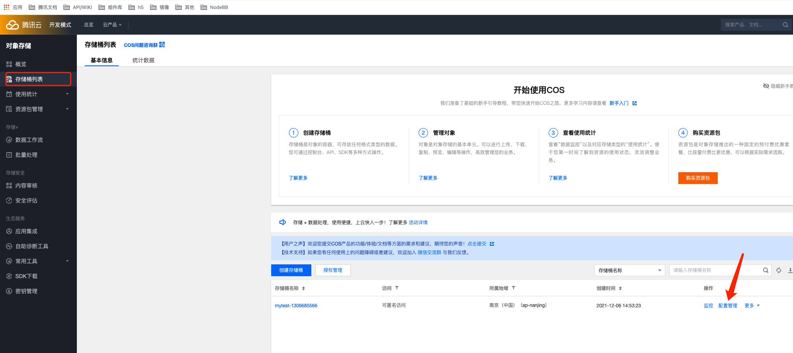
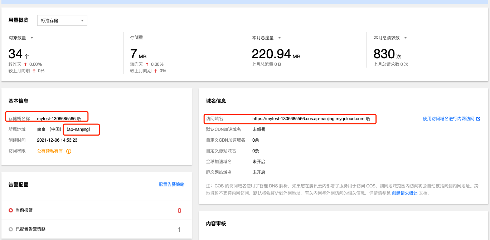

# 腾讯云对象存储（COS）插件

## 0.版本依赖

- NodeBB 1.16.2+
- [腾讯云插件中心插件](https://github.com/Tencent-Cloud-Plugins/tencentcloud-nodebb-plugin-common)

## 1. 插件介绍
| 标题      | 名称    |
| ----     | ---------------- |
| 中文名称   | 腾讯云图片内容安全（COS）插件 |
| 英文名称   | nodebb-plugin-tencentcloud-cos |
| 最新版本   | v1.0.2 (2021.12.13) |
| 适用平台   | [NodeBB](https://nodebb.org) |
| 适用产品   | [腾讯云对象存储（COS）](https://cloud.tencent.com/product/cos) |
| GitHub项目| [tencentcloud-nodebb-plugin-cos](https://github.com/Tencent-Cloud-Plugins/tencentcloud-nodebb-plugin-cos) |
| gitee项目| [tencentcloud-nodebb-plugin-cos](https://gitee.com/Tencent-Cloud-Plugins/tencentcloud-nodebb-plugin-cos) |
| 主创团队   | 腾讯云中小企业产品中心（SMB Product Center of Tencent Cloud） |

一款腾讯云研发的，提供给NodeBB站长使用的官方插件，将用户在发帖或回复时上传的图片或文件保存至腾讯云对象存储中心

## 2. 功能特性
- 对用户在发帖或回复时上传的图片或文件保存至腾讯云对象存储中心

## 3. 安装指引

本插件需要调用插件中心插件，所以请先安装并启用插件中心插件：

### 3.1.部署方式一：通过NodeBB站点后台安装
> 1. 你的NodeBB站点后台=》插件=》已安装 =》寻找插件。在页面搜索框输入nodebb-plugin-tencentcloud-cos
> 2. 点击"安装"按钮，就会自动下载安装插件
> 3. 部署并重启Nodebb应用(后台->右上角有个‘部署并重启论坛’按钮)
> 4. 启用该插件

### 3.2.部署方式二：通过npm安装
> 1. 在你的NodeBB项目根目录执行npm install nodebb-plugin-tencentcloud-cos
> 2. 部署并重启Nodebb应用(后台->右上角有个‘部署并重启论坛’按钮)
> 3. 启用插件

## 4. 使用指引
### 4.1.界面功能介绍

> 上图为后台配置页面。配置介绍请参考下方的[名词解释](#_4-2-名词解释)

### 4.2.名词解释
- **自定义密钥：** 插件提供统一密钥管理，既可在多个腾讯云插件之间共享SecretId和SecretKey，也可为插件配置单独定义的腾讯云密钥。
- **Secret ID：** 在[腾讯云API密钥管理](https://console.cloud.tencent.com/cam/capi)上申请的标识身份的 SecretId。
- **Secret Key：** 在[腾讯云API密钥管理](https://console.cloud.tencent.com/cam/capi)上申请的与SecretId对应的SecretKey。
- **名称：** 存储桶名称。
- **地域：** 存储桶地域。
- **访问域名：** 存储桶访问域名。
- **存储目录：** 存储目录，可不填。

如何填写名称，地域，访问域名? 如下图所示，腾讯云对象存储(https://console.cloud.tencent.com/cos)->存储桶列表->配置管理

## 5. 获取入口

| 插件入口      | 链接    |
| ----     | ---------------- |
| Github | [腾讯云图片内容安全（COS）插件](https://github.com/Tencent-Cloud-Plugins/tencentcloud-nodebb-plugin-cos) |
| Gitee | [腾讯云图片内容安全（COS）插件](https://gitee.com/Tencent-Cloud-Plugins/tencentcloud-nodebb-plugin-cos) |

## 6. FAQ
> 1. Q:腾讯云对象存储（COS）插件依赖别的插件吗？
>    
>    A:腾讯云对象存储（COS）插件插件依赖于腾讯云插件中心插件，所以请先安装并激活该插件,并配置好相应的插件配置

## 7. GitHub版本迭代记录

### 7.1. nodebb-plugin-tencentcloud-cos v1.0.2

- 对用户在发帖或回复时上传的图片或文件保存至腾讯云对象存储中心

## 8. 联系我们

如果您是用户，欢迎加入我们的[官方交流社区](https://dnspod.chat/?categoryId=10&sequence=0)，反馈
- bug和故障，获取帮助。
- 新的插件功能需求。
- 新的开源应用插件适配需求。

如果您是开发者，欢迎参与我们[插件开源项目](https://github.com/Tencent-Cloud-Plugins)，和我们一起修复插件问题，为更多开源应用适配腾讯云插件。
